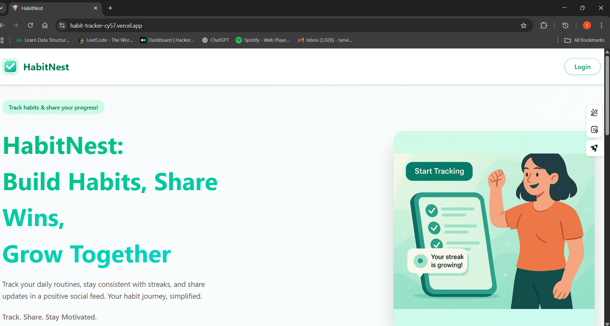
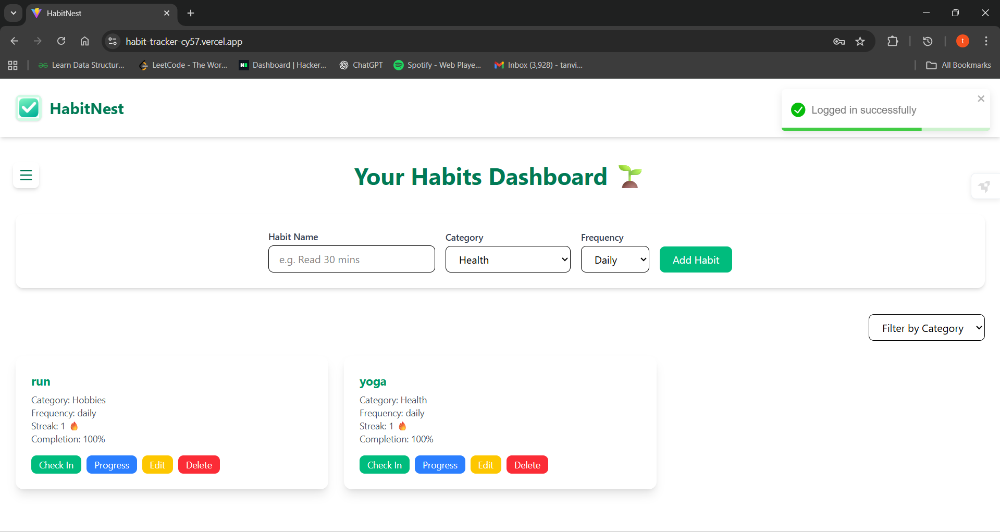
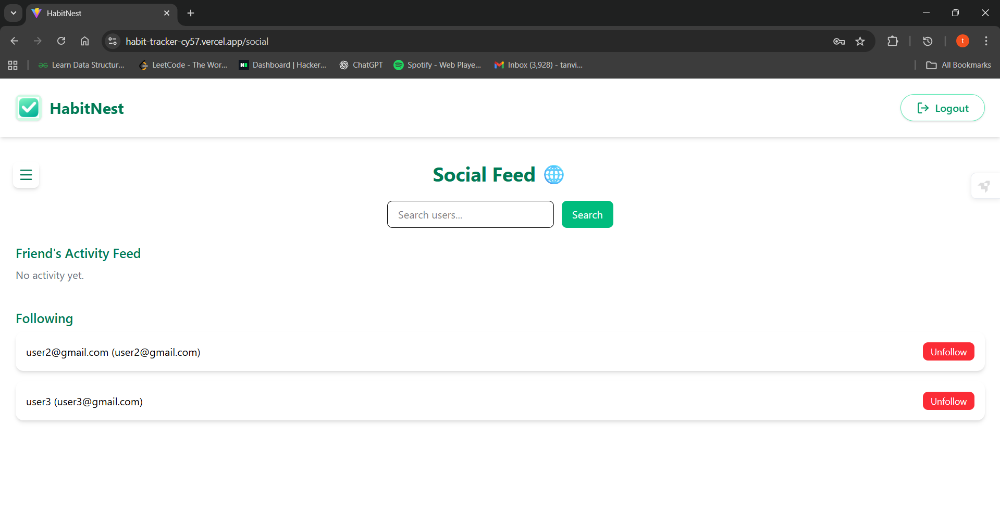
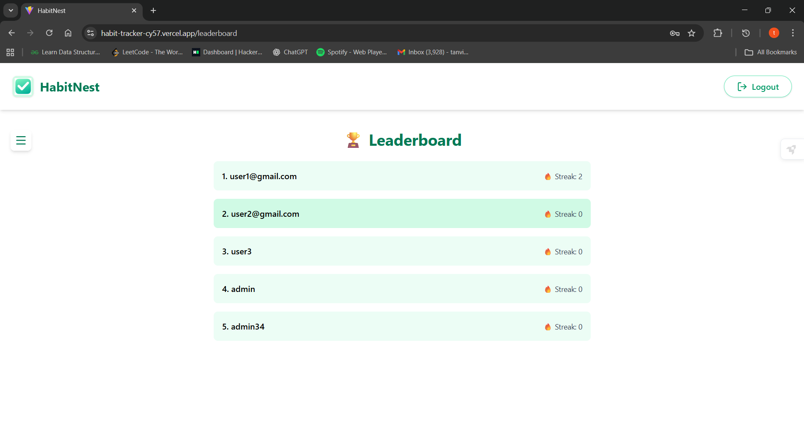

# HabitNest

**HabitNest** is a full-stack Habit Tracker Web Application designed to help users build positive habits, track their daily progress, and engage socially for accountability. Users can monitor their habits, view streaks, follow friends, and participate in a community-driven habit-building experience.

---

## Live Demo

[https://habit-tracker-cy57.vercel.app](https://habit-tracker-cy57.vercel.app)

---

## Features

### User Authentication
- Sign up, log in, and log out securely.
- Passwords are hashed before storage for security.

### Habit Management
- Create, edit, and delete personal habits.
- Mark daily or weekly check-ins to track progress.
- Track streaks and completion rates for each habit.
- Prevent duplicate habits per user and enforce single daily/weekly check-ins.

### Social Accountability
- Search for and follow other users.
- View friends’ recent check-ins and streaks in a social feed.
- Ensure users cannot follow themselves.

### Progress Visualization
- Dashboard displays user habits and daily check-in buttons.
- Visual indicators of streaks and progress percentages.
- Habit categories/tags with filtering for better organization.

### Leaderboard 
- Ranks users based on streak counts to encourage friendly competition.

---

## Screenshots


### Landing Page


### Dashboard


### Social Feed


### Leaderboard


---

## Tech Stack

- **Frontend:** React, Tailwind CSS
- **Backend:** Node.js, Express
- **Database:** MongoDB
- **Authentication:** JWT
- **State Management:** Zustand 
- **Hosting:** Vercel (frontend), Render (backend)

---

## Installation & Setup

1. Clone the repository:
```bash
git clone https://github.com/Tanvi-Ghadge/habit-tracker.git
# Backend
cd habit-tracker/backend
npm install
# Create a .env file with:
# PORT=5000
# DATABASE_URL=your_mongodb_or_postgres_connection_string
# JWT_SECRET=your_jwt_secret
# NODE_ENV=production
npm run dev

# Frontend
cd ../frontend
npm install
# Create a .env file with:
# VITE_API_URL=https://your-backend-url.com
npm run dev
